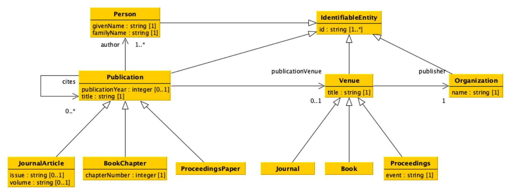
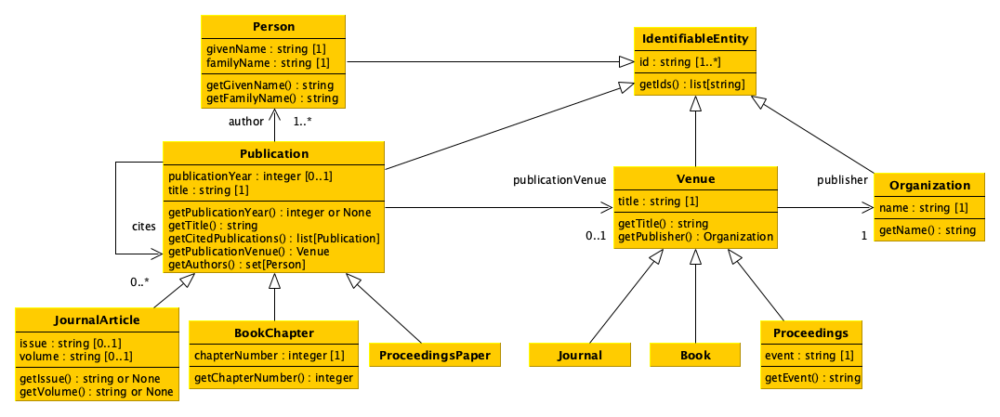
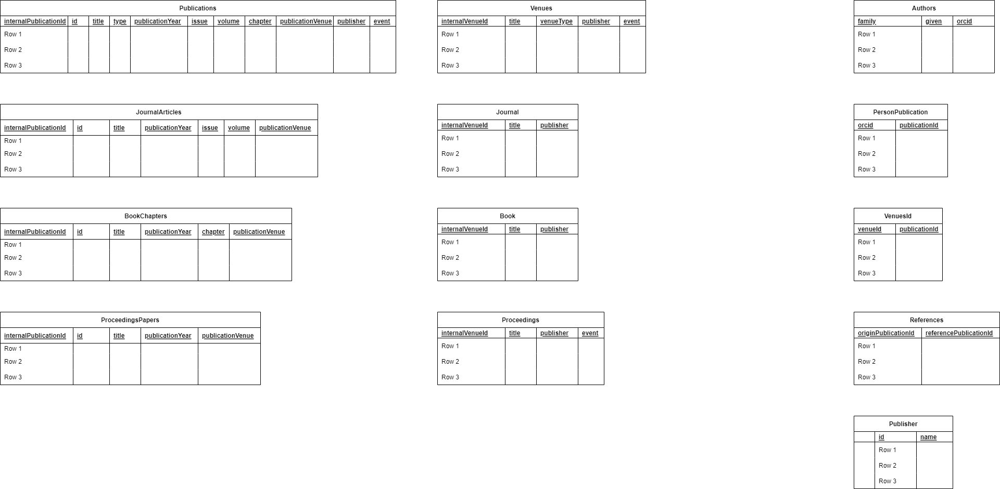
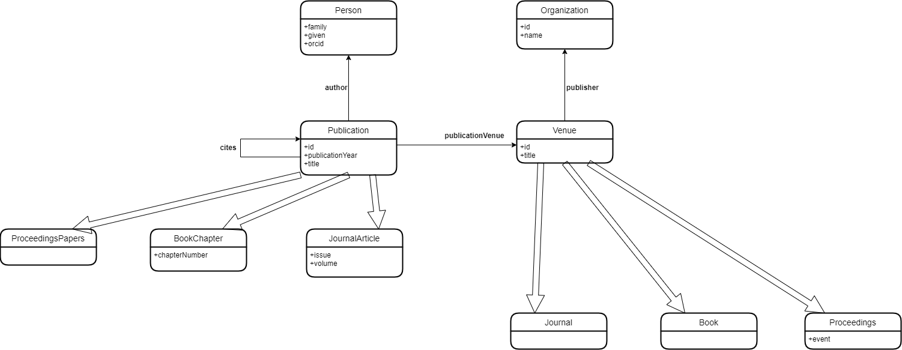

# Data Science Project - Data Processing and Querying Software

## Introduction

This project has been developed as part of the Data Science module, of the Computational Management of Data integrated course, taught by professor Silvio Peroni. Its team - Fsociety - is composed of Anastasiya Sopyryaeva, Seif Eddine Rayes, Francesca Budel and Victor Chaix, students of the Digital Humanities and Digital Knowlewdge (DHDK) Master degree program of the Università di Bologna. This is our attempt of developing the required software for data processing and querying purposes. 

### 1) Goal of the software and its corresponding data model
The goal of the project is to develop a software that enables one to process data stored in different formats and to upload them into two distinct databases to query these databases simultaneously according to predefined operations.

The data model on which the general organization of our software is based on can be represented and defined as follows:


   


The software's Python classes and their correspoding methods were then developed according to this more specific model: 



The data model refers to academic publications, relating to their venues, authors, etc., as well as all of their contained categories. 

*The Python classes and methods are defined in the DataModel.py file.*

### 2) Classes for processing the databases

To fulfill the goal of our software - interacting with the relational and graph databases - several classes were developed:

- RelationalProcessor and TripplestoreProcessor classes allow one to set the directory path to the relational and graph databases, respectively.

*The RelationalProcessor and The TripleProcessor classes are contained in the the RelationalProcessor.py and TripleProcessor.py files respecively.* 

- RelationDataProcessor and TriplestoreDataProcessor classes allow one to upload data to the appropriate database, relational or graph, using the uploadData methods of each class.

*TheRelationalDataProcessor and the TriplestoreDataProcessor classes are contained in the RelationalProcessor.py and TripleProcessor.py files respecively.* 

These uploadData methods allow one to load data in two formats: csv and/or json.

Uploaded files must have the following structures:

- for a CSV file:

column names: datatype<br>
"id": "string",<br>
"title": "string",<br>
"type": "string",<br>
"publication_year": "int",<br>
"issue": "string",<br>
"volume": "string",<br>
"chapter": "string",<br>
"publication_venue": "string",<br>
"publisher": "string",<br>
"event": "string"<br>

- for a JSON file:

It should contain 4 main keys:

1. key "authors" containing dictionaries with publication ids as keys. 

**Properties of this key**: each publication_id contains a list as value; each list contains dictionaries with the following keys: "family", "given", "orcid"; all datatypes are strings.

2. key "venues_id" containing dictionaries with publication ids as keys. 

**Properties of this key**: each publication_id contains a list as value; each list contains venue ids associated with the publication id; all datatypes are strings.

3. key "references" containing dictionaries with publication ids as keys. 

**Properties of this key**: each publication_id contains a list as value; each list contains reference publication ids; all datatypes are strings.

4. key "publishers" containing dictionaries with publisher ids as keys. 

**Properties of this key**: each publisher id contains a dictionary as value; each dictionary contains two keys: "id" and "name"; all datatypes are strings.

-----

The databases in which are uploaded all of the given data are organized according to the following structures:

- For the Relational database:



- For the Graph database:



Once the data is uploaded into the databases, the RelationDataProcessor and TriplestoreDataProcessor classes serve as a basis to query data with SQL (for relational databases) or SPARQL (for graph databases).

### 3) Classes for querying the databases

RelationalQueryProcessor and TriplestoreQueryProcessor classes contain a set of predefined query methods for retrieving the data from the databases. It is possible to use them for querying information from the relevant database and return data as pandas dataframes.

The list of methods is defined as follows:

- getPublicationsPublishedInYear: It returns a data frame with all the publications (i.e. the rows) that have been published in the input year (e.g. 2020).

- getPublicationsByAuthorId: It returns a data frame with all the publications (i.e. the rows) that have been authored by the person having the identifier specified as input (e.g. "0000-0001-9857-1511").

- getMostCitedPublication: It returns a data frame with all the publications (i.e. the rows) that have received the most number of citations by other publications.

- getMostCitedVenue: It returns a data frame with all the venues (i.e. the rows) containing the publications that, overall, have received the most number of citations by other publications.

- getVenuesByPublisherId: It returns a data frame with all the venues (i.e. the rows) that have been published by the organization having the identifier specified as input (e.g. "crossref:78").

- getPublicationInVenue: It returns a data frame with all the publications (i.e. the rows) that have been included in the venue having the identifier specified as input (e.g. "issn:0944-1344").

- getJournalArticlesInIssue: It returns a data frame with all the journal articles (i.e. the rows) that have been included in the input issue (e.g. "9") of the input volume (e.g. "17") of the journal having the identifier specified as input (e.g. "issn:2164-5515").

- getJournalArticlesInVolume: It returns a data frame with all the journal articles (i.e. the rows) that have been included, independently from the issue, in input volume (e.g. "17") of the journal having the identifier specified as input (e.g. "issn:2164-5515").

- getJournalArticlesInJournal: It returns a data frame with all the journal articles (i.e. the rows) that have been included, independently from the issue and the volume, in the journal having the identifier specified as input (e.g. "issn:2164-5515").

- getProceedingsByEvent: It returns a data frame with all the proceedings (i.e. the rows) that refer to the events that match (in lowercase), even partially, with the name specified as input (e.g. "web").

- getPublicationAuthors: It returns a data frame with all the authors (i.e. the rows) of the publication with the identifier specified as input (e.g. "doi:10.1080/21645515.2021.1910000").

- getPublicationsByAuthorName: It returns a data frame with all the publications (i.e. the rows) that have been authored by the people having their name matching (in lowercase), even partially, with the name specified as input (e.g. "doe").

- getDistinctPublisherOfPublications: It returns a data frame with all the distinct publishers (i.e. the rows) that have published the venues of the publications with identifiers those specified as input (e.g. [ "doi:10.1080/21645515.2021.1910000", "doi:10.3390/ijfs9030035" ]).

In addition to this queries required for the project, we created three other queries to meet the specific needs of retrieving information about citations (of publications), venues id (by title) and publisher (by venue title), that would then be of use when running the generic queries:

- getPublicationsCitations: It returns a dataframe with all the publications (i.e. the rows) that have been referenced in the publication, with the publication id specified as input.

- getVenuesIdbyTitle: It returns a dataframe with all venue ids (i.e. the rows) associated with a venue, with the title specified as input.

- getPublisherbyVenueTitle: It returns a dataframe with all the publishers (i.e. the rows) that published a venue, with the title specified as input.

*The RelationalQueryProcessor class is contained in the RelationalProcessor.py file.*

*The TripleQueryProcessor class is contained in the TriplestoreProcessor.py file.*

----

The GenericQueryProcessor class is designed to be able to query from two databases (of different types) simultaneously. The class contains the same set of methods as the RelationalQueryProcessor and the TriplestoreQueryProcessor classes, but returns Python Objects (instead of dataframes), related to classes of the Data Model mentionned in section 1).

We developed one additional method for the GenericQueryProcessor class, in order to return venues as Python objects:

- getVenuebyTitle: it returns a Venue object, with the title specified as input.

*The GenericQueryProcessor class is contained in the GenericProcessor.py file.*


### 4) How to initiate and run the software

The software is developed in Python programming language. In order to run it successfully, one has to have the following Python libraries and additional applications:

- Python Pandas (command: pip install pandas)

- Blazegraph application for working with the graph database (one has to download the .jar application, put it in a directory, and run it from a shell through the following command: java -server -Xmx1g -jar blazegraph.jar). One need at least Java 9 installed

- RDFlib library (command: pip install rdflib)

- sparql_dataframe library (command: pip install sparql_dataframe)

Then, these are the steps for running the software, to process and query the databases: 

0. download *Software_PythonFiles* folder where the software is stored

1. import all the classes from the impl.py file (All the classes necessary for working with the program are contained in the impl.py file)

2. create the relational database using the related source data and classes

3. create the query processor for the relational database, using the related source data and classes

4. create the RDF triplestore (remember first to run the Blazegraph application), using the related source data and classes

5. create the query processor for the graph database, using the related classes

6. create a generic query processor, using the related class, for asking about the data

7. start querying

Here is an example in the Python formalization of these (natural language) steps:

*sample data is stored in "data" folder*

```
# import all the classes from the impl.py file
from impl import *

# create the relational database using the related source data and classes
rel_path = "relational.db"
rel_dp = RelationalDataProcessor()
rel_dp.setDbPath(rel_path)

# example data files
rel_dp.uploadData("../data/relational_other_data.json")
rel_dp.uploadData("../data/relational_publications.csv")

# create the query processor for the relational database, using the related source data and classes
rel_qp = RelationalQueryProcessor()
rel_qp.setDbPath(rel_path)

# create the RDF triplestore (remember first to run the Blazegraph application), using the related source data and classes
grp_endpoint = "http://127.0.0.1:9999/blazegraph/"
grp_dp = TriplestoreDataProcessor()
grp_dp.setEndpointUrl(grp_endpoint)

# example data files
grp_dp.uploadData("../data/graph_publications.csv")
grp_dp.uploadData("../data/graph_other_data.json")

# create the query processor for the graph database, using the related classes
grp_qp = TriplestoreQueryProcessor()
grp_qp.setEndpointUrl(grp_endpoint)

# create a generic query processor, using the related class, for asking about the data
generic = GenericQueryProcessor()
generic.addQueryProcessor(rel_qp)
generic.addQueryProcessor(grp_qp)

# The generic query processor now allows to return python objects defined according to the datamodel. 

# Example query
result_q1 = generic.getPublicationsPublishedInYear(2020)
print(result_q1)

# Those returned objects can be stored in variables, through which those same objects' methods may be called depending on the user's needs. 
```
